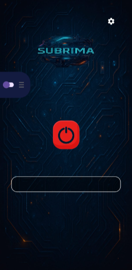
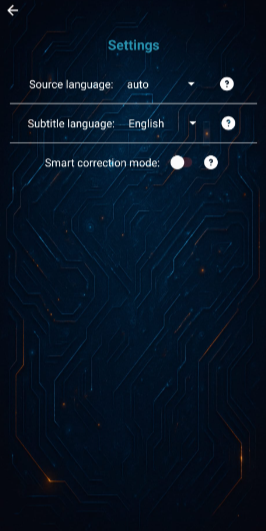

# SUBRIMA (Android Subtitle Overlay)

SUBRIMA is an Android app that captures device playback audio, transcribes speech in near real time, optionally translates it, and renders subtitles as a floating overlay above other apps.

The project is feature-rich and still evolving. The main runtime path is stable enough for regular use, while several modules under `archive/` are kept for research and experimentation.

## Table of Contents

- [Overview](#overview)
- [Current Runtime Pipeline](#current-runtime-pipeline)
- [Architecture](#architecture)
- [Repository Structure](#repository-structure)
- [Core Components](#core-components)
- [Requirements](#requirements)
- [Model and Runtime Downloads](#model-and-runtime-downloads)
- [Setup Profiles](#setup-profiles)
- [Build and Run](#build-and-run)
- [Permissions](#permissions)
- [Usage](#usage)
- [Screenshots and Demo](#screenshots-and-demo)
- [Troubleshooting](#troubleshooting)
- [Security Notes](#security-notes)
- [Experimental Modules (`archive/`)](#experimental-modules-archive)
- [Roadmap Ideas](#roadmap-ideas)
- [Project Documents](#project-documents)
- [License](#license)

## Overview

### What the app solves

Many Android audio sources (social media, calls, streams, browser media, local playback) do not provide reliable live subtitles. SUBRIMA adds an always-on-top subtitle layer without requiring cloud transcription.

### What is currently implemented

- Playback audio capture with `MediaProjection` + `AudioPlaybackCapture` (Android 10+)
- Automatic source-language detection (Silero ONNX model)
- Streaming transcription with dynamic Vosk model switching
- Optional Whisper-based post-correction path (experimental)
- On-device translation with Google ML Kit
- Overlay subtitle rendering with RTL/LTR handling and floating controls

## Current Runtime Pipeline

1. `MainActivity` collects permissions and starts services.
2. `AudioCaptureService` receives MediaProjection data and initializes capture.
3. `StreamAudioCapturer` emits 250 ms PCM chunks at 16 kHz.
4. `transcriptManager` routes each chunk through:
   - `SileroLanguageDetector` (auto source detection)
   - `VoskStreamTranscriber` (main STT)
   - `WhisperTranscriber` (optional smart-correction mode)
5. `MainPipeline` receives transcript updates.
6. `MlKitTranslator` translates to subtitle language when needed.
7. `SubtitleOverlayService` displays the latest subtitle text.

## Architecture

### Layered view

```text
UI Layer
  MainActivity, SettingsActivity
  FloatingToggleButtonService, SubtitleOverlayService

Orchestration Layer
  MainPipeline
  transcriptManager

Model/Processing Layer
  StreamAudioCapturer
  SileroLanguageDetector
  VoskStreamTranscriber
  SpeakerChangeDetector
  MlKitTranslator
  WhisperTranscriber (optional)

Native Layer
  app/src/main/jni/whisper/*
  app/src/main/jni/sentencepiece/* (archive-related)

Assets and Model Metadata
  app/src/main/assets/lang.json
  app/src/main/assets/google_dict.json
  app/src/main/assets/lang_classifier_95.onnx
  app/src/main/assets/model.onnx
  app/src/main/assets/vosk_models/*
  app/src/main/assets/whisper_models/*
```

### Runtime notes

- Vosk language models are loaded/switched by `LanguageModelManager`.
- Source language auto-detection is independent from translation language selection.
- Speaker-change logic is embedding-based (`model.onnx`) and used to improve segmentation/reset behavior.
- Whisper correction is tied to the settings flag `pref_smart_correction` and is not required for baseline usage.

## Repository Structure

```text
.
|- app/
|  |- src/main/java/com/example/subtitles/
|  |  |- model/                 # audio, language, transcription, translation
|  |  |- view/                  # overlay + settings UI
|  |  |- view_model/            # MainPipeline + transcriptManager
|  |  |- util/                  # asset and JSON helpers
|  |  |- archive/               # experimental/legacy code paths
|  |- src/main/assets/
|  |  |- lang.json              # Vosk model URLs and folder mapping
|  |  |- google_dict.json       # language code mapping to ML Kit codes
|  |  |- lang_classifier_95.onnx
|  |  |- model.onnx             # speaker embedding model
|  |  |- vosk_models/en/        # bundled fallback English model
|  |  |- whisper_models/        # Whisper .bin model files
|  |- src/main/jni/
|  |  |- whisper/               # whisper.cpp JNI bridge
|  |  |- sentencepiece/         # sentencepiece JNI bridge (archive experiments)
|- docs/                        # sample images/video
|- README.md
|- CREDITS.md
|- CONTRIBUTING.md
|- SECURITY.md
```

## Core Components

| Component | Path | Role |
|---|---|---|
| App entry point | `app/src/main/java/com/example/subtitles/MainActivity.java` | Permission flow, service startup, pipeline lifecycle |
| Pipeline coordinator | `app/src/main/java/com/example/subtitles/view_model/MainPipeline.java` | Connects transcription, translation, and overlay updates |
| Transcription manager | `app/src/main/java/com/example/subtitles/view_model/transcriptManager.java` | Drives capture, LID, Vosk, and optional Whisper correction |
| Audio capture | `app/src/main/java/com/example/subtitles/model/audio/StreamAudioCapturer.java` | Playback capture in fixed chunks |
| Transcriber | `app/src/main/java/com/example/subtitles/model/transcription/core/VoskStreamTranscriber.java` | Streaming speech-to-text + model switching |
| LID | `app/src/main/java/com/example/subtitles/model/language/SileroLanguageDetector.java` | Source-language classification from audio windows |
| Translation | `app/src/main/java/com/example/subtitles/model/translation/MlKitTranslator.java` | On-device translation and model readiness handling |
| Speaker change | `app/src/main/java/com/example/subtitles/model/speaker/SpeakerChangeDetector.java` | Embedding-based speaker shift signal |
| Overlay subtitles | `app/src/main/java/com/example/subtitles/view/overlay/SubtitleOverlayService.java` | Floating subtitle rendering |
| Overlay toggle | `app/src/main/java/com/example/subtitles/view/overlay/FloatingToggleButtonService.java` | Floating on/off control |
| Vosk model manager | `app/src/main/java/com/example/subtitles/model/transcription/core/LanguageModelManager.java` | Model download, extract, cache, fallback |

## Requirements

| Item | Current project setting |
|---|---|
| Android API min | 29 (Android 10) |
| Android API target | 35 |
| compileSdk | 35 |
| Java | 11 |
| AGP | 8.11.1 |
| Gradle wrapper | 8.13 |
| NDK | 26.1.10909125 |
| CMake | 3.22.1 |

Practical hardware guidance:

- At least 2 GB RAM (4 GB+ recommended for smoother behavior)
- Free storage for model files (size depends on Vosk/Whisper model choices)

## Model and Runtime Downloads

The app now supports first-run automatic download for startup-required models.

What this means in practice:

- No manual model pre-copy is required for normal first launch on device.
- On first run, the app downloads required startup models and stores them locally.
- Source links are still listed below for transparency and verification.
- Those links are third-party external hosts and are not controlled by this project.

### 1) Translation (Google ML Kit)

- Active translation path uses `com.google.mlkit:translate`.
- No manual model preparation is required.
- ML Kit handles model download and cleanup internally.

### 2) Transcription (Vosk)

- Vosk model links are defined in `app/src/main/assets/lang.json`.
- Models are downloaded automatically when needed.
- `LanguageModelManager` keeps a local cache and can fall back to the last successful model.
- Keeping an English fallback model in assets is strongly recommended:
  - Path: `app/src/main/assets/vosk_models/en`
  - Folder name must remain `en`.

Note: `lang.json` contains many language codes, but only entries with valid `transcript_link` are directly downloadable.

### 3) Source language auto-detection model (Silero)

Default behavior:

- Downloaded automatically on first run if missing.

Manual/reference file path (if you want to pre-provision it):

- `app/src/main/assets/lang_classifier_95.onnx`

Reference source used by this project:

- `https://huggingface.co/Derur/silero-models/blob/main/lang95/lang_classifier_95.onnx`

### 4) Speaker embedding model

Default behavior:

- Downloaded automatically on first run if missing.

Manual/reference file path for current speaker-change detection path:

- `app/src/main/assets/model.onnx`

The app currently expects the filename `model.onnx` unless code is changed in `SpeakerChangeDetector`.

Example model source family used by this project:

- `https://huggingface.co/deepghs/pyannote-embedding-onnx`

- `https://huggingface.co/nevil-ramani/pyannote_embedding_onnx/tree/main`

### 5) Whisper integration (optional, experimental)

Whisper is integrated behind smart-correction mode and is not required for baseline usage quality.

Important setup details:

1. Place a `whisper_cpp` folder as a sibling of this repository (not inside it), because JNI CMake expects:
   - `../whisper_cpp`
2. Put a Whisper `.bin` model in:
   - `app/src/main/assets/whisper_models/`
3. Ensure the Java constant in `WhisperTranscriber` matches the file name/path:
   - `MODEL_PATH = "whisper_models/ggml-tiny-q5_1.bin"` (default in code)

Recommendation:

- Use a small multilingual model for mobile performance.
- Keep smart-correction mode disabled if you only want stable baseline subtitles.

### 6) SentencePiece and Falcon (archive experiments)

- `SentencePiece` and `Falcon` code is under `app/src/main/java/com/example/subtitles/archive/`.
- They are not in the active runtime path.
- You may ignore them for normal operation.

If you remove archive SentencePiece usage, also remove JNI/CMake integration in `app/src/main/jni/` to avoid build/startup issues.

## Setup Profiles

| Profile | Best for | What to prepare |
|---|---|---|
| Baseline (recommended) | Normal subtitles/transcription usage | Vosk + ML Kit + `lang_classifier_95.onnx` + `model.onnx`; keep smart correction off |
| Whisper-enabled | Trying smart correction mode | Baseline + sibling `../whisper_cpp` + a Whisper `.bin` in `assets/whisper_models` |
| Archive exploration | Research/learning old experiments | Whisper-enabled plus any archive-specific edits/tests you want to run |

Additional note: UI language pickers currently expose `auto,en,he,fr,es,de,ar,ru,zh,ja`, while `lang.json` includes a wider model catalog for dynamic Vosk loading.

Build-system note: current `app/src/main/jni/CMakeLists.txt` always includes both `whisper/` and `sentencepiece/` subdirectories. If you want a minimal build without them, edit that CMake file accordingly.

## Build and Run

### Android Studio

1. Install Android Studio with SDK 35, NDK `26.1.10909125`, and CMake `3.22.1`.
2. Clone and open the project.
3. For baseline usage, just run the app once with internet enabled so startup models can be downloaded automatically.
4. If Whisper JNI is kept enabled, ensure sibling `../whisper_cpp` exists.
5. Sync Gradle and run on an Android 10+ device.

### Command line

```bash
./gradlew assembleDebug
```

Windows:

```powershell
.\gradlew.bat assembleDebug
```

## Permissions

| Permission | Why it is needed |
|---|---|
| `RECORD_AUDIO` | Audio capture pipeline requirements |
| `FOREGROUND_SERVICE` | Persistent services for capture/overlay |
| `FOREGROUND_SERVICE_MEDIA_PROJECTION` | Playback capture service |
| `FOREGROUND_SERVICE_MEDIA_PLAYBACK` | Service type declarations |
| `SYSTEM_ALERT_WINDOW` | Draw floating subtitles/toggle over other apps |
| `INTERNET` | Model downloads (Vosk/ML Kit and related resources) |
| `READ/WRITE_EXTERNAL_STORAGE` | Legacy compatibility paths |

## Usage

1. Open app and grant requested permissions.
2. Enable overlay permission in system settings when prompted.
3. Approve screen capture request.
4. Tap main power button to show floating toggle.
5. Turn floating toggle on to start subtitles.
6. Open settings to control:
   - Source language (`auto` or manual)
   - Subtitle language
   - Smart correction mode (Whisper-assisted, experimental)

## Screenshots and Demo

<p align="center">
  
  &nbsp;&nbsp;&nbsp;&nbsp;
  
</p>

<p align="center">
  <b>Sample video:</b><br><br>
  <video src="https://github.com/user-attachments/assets/f82c6803-7e0f-4e07-bfa4-0cfe2bced5a2" width="80%" controls></video>
</p>

## Troubleshooting

| Problem | Typical cause | Fix |
|---|---|---|
| Gradle/CMake fails with missing `whisper_cpp` files | `../whisper_cpp` folder is missing | Clone/download `whisper.cpp` and place it as sibling folder named `whisper_cpp` |
| Build fails in `sentencepiece` native step | Network/offline issues during ExternalProject fetch | Keep internet enabled for first native build, or remove sentencepiece JNI integration if not needed |
| App starts but no subtitles appear | Overlay/capture permissions not fully granted | Re-grant `SYSTEM_ALERT_WINDOW` and screen capture permissions |
| First run does not complete model setup | Network blocked/unstable or host unavailable | Verify internet access, retry app launch, and check external model source availability |
| Auto language switch not working | Missing or invalid `lang_classifier_95.onnx` | Verify file path and filename in assets |
| Speaker-change behavior weak or noisy | Missing/incompatible `model.onnx` | Replace with a valid embedding ONNX model and keep expected path/name |
| Translation stuck at loading | ML Kit model still downloading or not ready | Keep internet on until first model download completes |
| Runtime is slow with smart correction | Whisper model too heavy for device | Use smaller Whisper model and/or disable smart correction |

## Security Notes

- Vosk model URLs are configured in `app/src/main/assets/lang.json` and may point to external hosts (for example alphacephei/archive mirrors).
- Startup-required model downloads also rely on external third-party hosts.
- You should review those URLs if your environment has strict security requirements.
- This project does not control third-party hosting availability or content integrity.

## Experimental Modules (`archive/`)

The `archive/` folder is intentionally kept for experimentation and learning:

- Legacy Vosk window-based transcription path
- Falcon-based speaker detection experiments
- SentencePiece + M2M100 translation experiments
- WAV utility/test helpers

Normal app operation does not require these modules.

## Roadmap Ideas

- Improve stability and startup checks for optional model dependencies
- Add clearer runtime diagnostics for missing assets/models
- Reduce JNI/native setup friction for optional experimental modules
- Improve subtitle quality controls (timing, segmentation, styling)
- Expand language coverage in UI settings beyond current default list

## Project Documents

- Credits: [CREDITS.md](CREDITS.md)
- Contributing: [CONTRIBUTING.md](CONTRIBUTING.md)
- Security: [SECURITY.md](SECURITY.md)
- Code of Conduct: [CODE_OF_CONDUCT.md](CODE_OF_CONDUCT.md)

## License

Licensed under GNU GPL v3.0. See [LICENSE](LICENSE).
